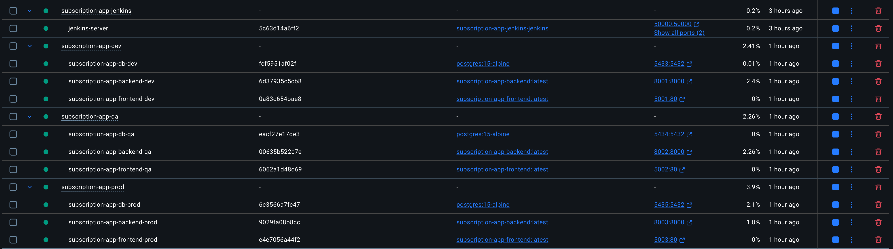
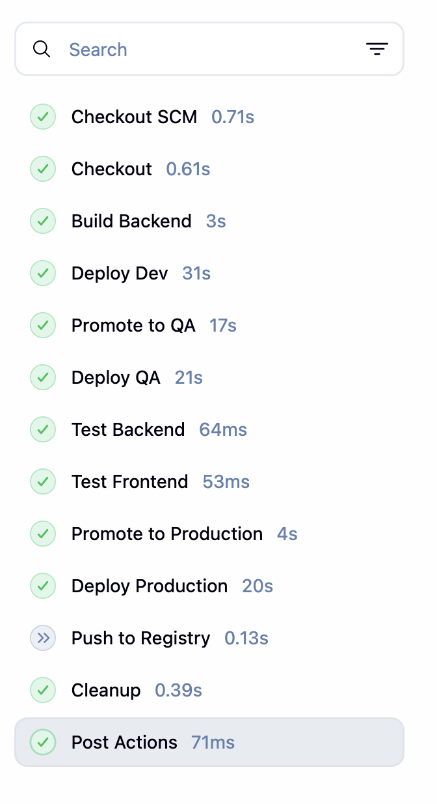
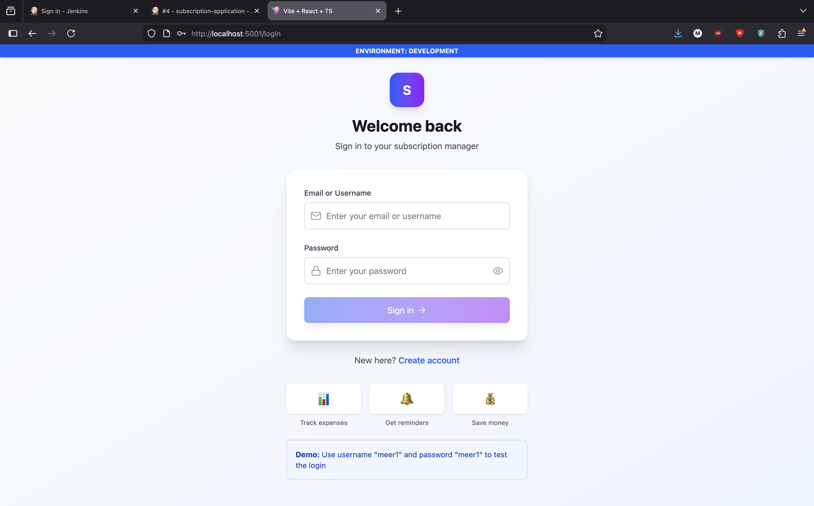
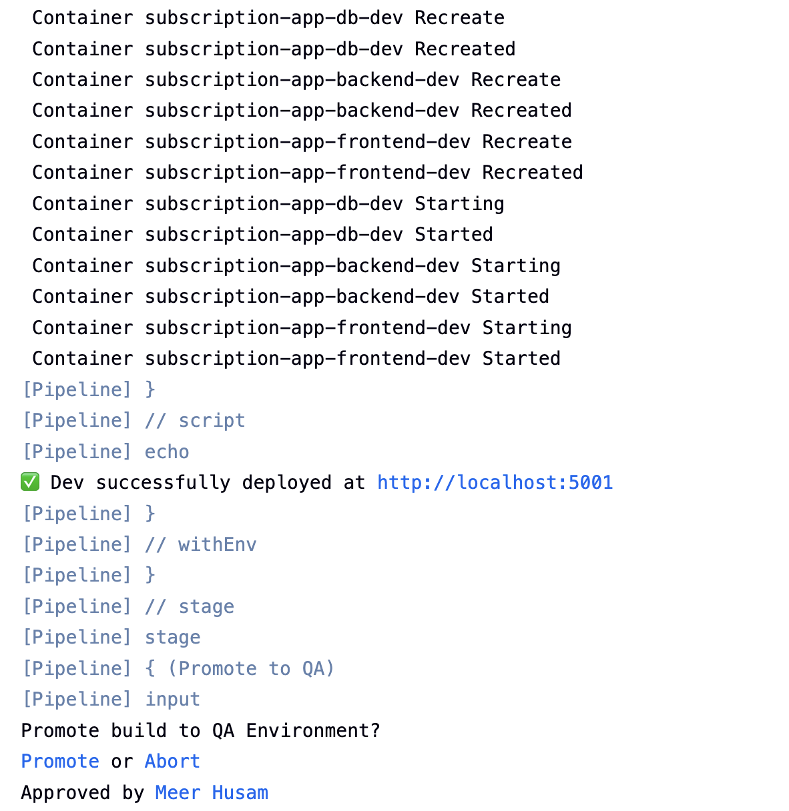
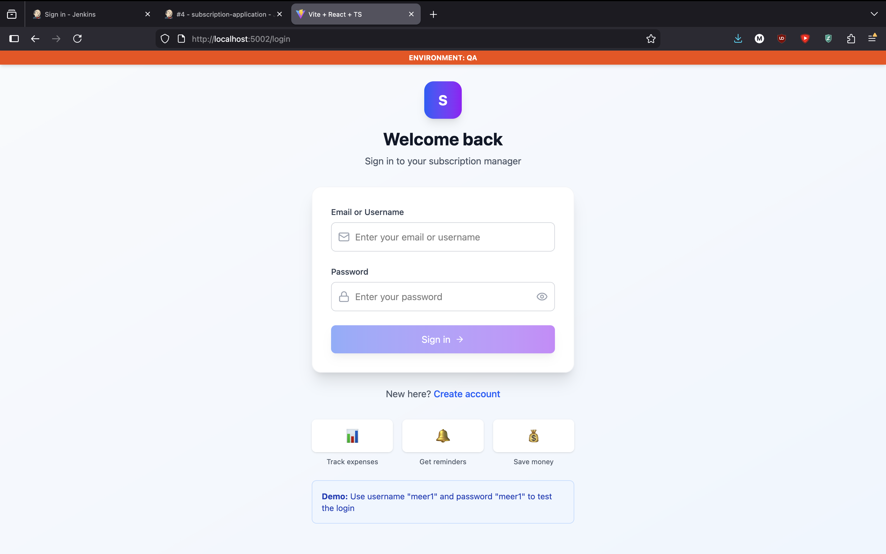
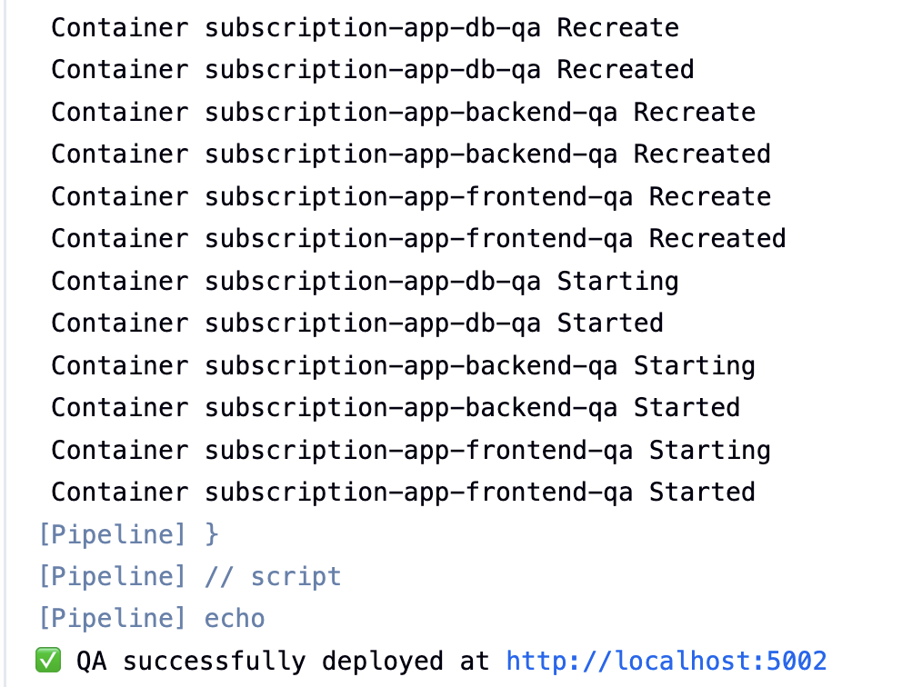
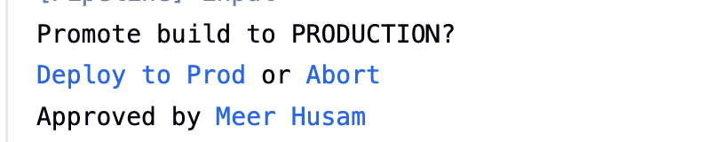
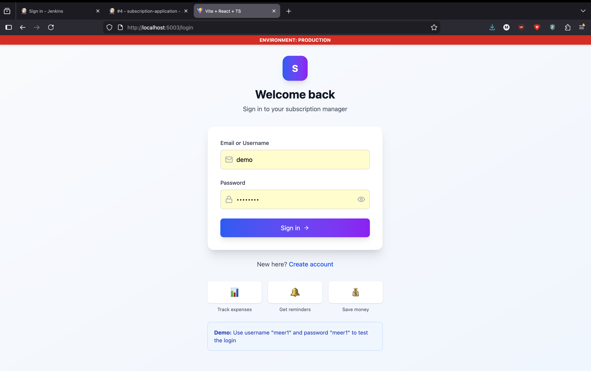
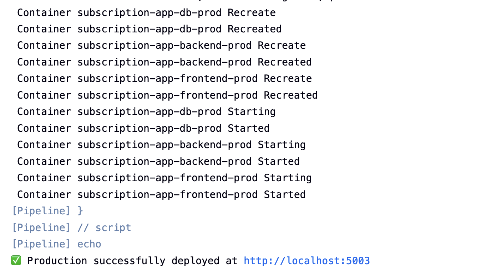

# CI/CD Pipeline Documentation

> **Project:** Multi-Environment CI/CD Pipeline (DevOps Assignment)
> **Author:** Meer Husamuddin
> **Repository:** [\[Link to Repo\]](https://github.com/MeerHusam/subscription-app.git)

## 1. Overview
This project implements a comprehensive CI/CD pipeline using **Jenkins**, **Docker**, and **Nginx**. The pipeline automates the build, test, and deployment of a full-stack web application (React + Django) across three distinct environments: **Development**, **QA**, and **Production**. It features manual approval gates for promotion and dynamic environment configuration.

---

## 2. Architecture Diagram

The following diagram illustrates the flow from code commit to production deployment.

```mermaid
graph LR
    User[Developer] -->|Push Code| Github[GitHub Repository]
    Github -->|Webhook| Jenkins[Jenkins CI/CD]
    
    subgraph Jenkins Pipeline
        Checkout[Checkout Code] --> Build[Build Backend Docker Image]
        Build --> DeployDev[Deploy to DEV]
        DeployDev --> ApproveQA{Promote to QA?}
        ApproveQA -->|Yes| BuildQA[Build Frontend for QA]
        BuildQA --> DeployQA[Deploy to QA]
        DeployQA --> ApproveProd{Promote to PROD?}
        ApproveProd -->|Yes| BuildProd[Build Frontend for PROD]
        BuildProd --> DeployProd[Deploy to PROD]
    end

    subgraph Docker Host
        direction TB
        DevEnv[Dev Environment<br>FE: :5001 | BE: :8001]
        QAEnv[QA Environment<br>FE: :5002 | BE: :8002]
        ProdEnv[Prod Environment<br>FE: :5003 | BE: :8003]
    end

    DeployDev -.-> DevEnv
    DeployQA -.-> QAEnv
    DeployProd -.-> ProdEnv
```

---

## 3. Environment Configuration

To simulate multiple environments on a single host, I use distinct port mappings and environment variables. The pipeline dynamically injects these during the build/deploy process.

| Environment | Frontend Port | Backend Port | API Base URL | Environment Badge |
| :--- | :--- | :--- | :--- | :--- |
| **Development** | `5001` | `8001` | `/api` | **Blue** (DEV) |
| **QA** | `5002` | `8002` | `/api` | **Orange** (QA) |
| **Production** | `5003` | `8003` | `/api` | **Red** (PROD) |

### Key Configuration Details:
*   **Dynamic Frontend Configuration:** The React app uses `VITE_ENV_NAME` to display the current environment name in the UI (`EnvironmentBadge.tsx`). This variable is baked into the image at build time using Docker `--build-arg`.
*   **Backend:** A single backend image builds once and is retagged for each environment, ensuring binary consistency.
*   **Networking:** Nginx proxies api requests to the backend container within the Docker network, eliminating CORS issues.

---

## 4. Pipeline Structure & Approval Process

The pipeline is defined in `Jenkinsfile` and follows a sequential promotion strategy:

1.  **Checkout:** Pulls the latest code from the repository.
2.  **Build (Backend):** Builds the backend Docker image and tags it with the unique `BUILD_NUMBER`.
3.  **Deploy Dev:**
    *   Builds the Frontend image specifically for Dev (injecting `VITE_ENV_NAME=Development`).
    *   Deploys `subscription-app-dev` stack.
    *   **Verification:** Automatically accessible at `http://localhost:5001`.
4.  **Manual Approval (Gate 1):**
    *   Jenkins pauses and waits for user input: *"Promote build to QA Environment?"*
    *   This prevents untested code from reaching QA automatically.
5.  **Deploy QA:**
    *   Upon approval, builds Frontend for QA.
    *   Deploys `subscription-app-qa` stack (`:5002`).
6.  **Manual Approval (Gate 2):**
    *   Jenkins pauses: *"Promote build to PRODUCTION?"*
    *   Final sign-off required before touching the live environment.
7.  **Deploy Production:**
    *   Builds Frontend for Production.
    *   Deploys `subscription-app-prod` stack (`:5003`).

---

## 5. Verification Screenshots




**1. Jenkins Pipeline View:**



**2. Development Environment (Blue Badge):**



**3. QA Environment (Orange Badge):**




**4. Production Environment (Red Badge):**


---

## 6. Challenges & Solutions
*(Detailed in `docs/CICD_Lessons.md`)*

*   **Issue:** Docker Compose using stale `:latest` images.
    *   **Fix:** Explicitly retag images during deployment and use `--force-recreate`.
*   **Issue:** Frontend environment variables not updating at runtime.
    *   **Fix:** React/Vite variables are build-time only. Adjusted pipeline to rebuild the frontend image for each environment with the correct `--build-arg`.

---

## 7. How to Run via Jenkins (Recommended)

Instead of running Docker commands manually, the preferred way is to use the automated pipeline:

1.  **Start Jenkins:**
    ```bash
    docker-compose -f docker-compose.jenkins.yml up -d
    ```
2.  **Access UI:** Open `http://localhost:8080`
3.  **Run Pipeline:**
    - Go to the `subscription-app-pipeline` job.
    - Click **Build Now** on the left menu.
4.  **Approve Deployments:**
    - The pipeline will pause at "Promote to QA" and "Promote to Production".
    - Click **Proceed** in the Jenkins UI to continue deployment.

For detailed setup instructions, please refer to [`docs/JENKINS_QUICKSTART.md`](docs/JENKINS_QUICKSTART.md).
