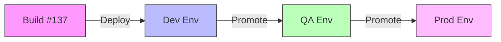
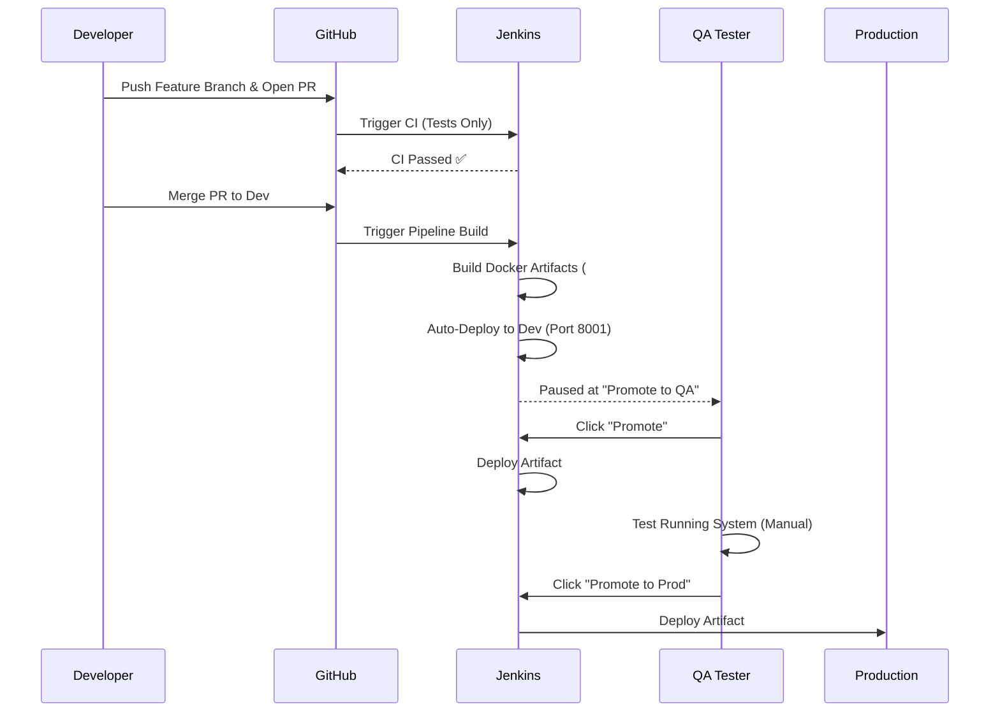

# CI/CD, Jenkins, and QA: A Clear End-to-End Mental Model

This guide establishes the core mental models for our CI/CD pipeline, artifact-based promotion, and the role of QA.

---

## 1. Core Mental Models

### Pipeline vs. Builds
*   **Jenkinsfile (Pipeline):** The blueprint or recipe. It defines *how* to build and deploy.
*   **Builds (Runs):** The individual houses built from that blueprint.
    *   Each trigger (PR merge, manual run) creates a new, independent build timeline (e.g., Build #12, #13).
    *   Builds are immutable; once finished, they don't change.

### CI vs. CD
| Concept | Purpose | When it runs | What it touches |
| :--- | :--- | :--- | :--- |
| **CI (Continuous Integration)** | Verify code correctness | PRs, Feature Branches | Code, Lint, Unit Tests |
| **CD (Continuous Delivery)** | Move artifacts to environments | After Merge / Manual Gates | Artifacts, Docker, Servers |

> **Key Rule:** CI ≠ Deployment. CI checks if code is good; CD puts it in front of users.

---

## 2. What an Artifact Is (Critical)

An **Artifact** is the immutable output of a build. In our case, it is the Docker Image.

*   **Example:** `backend:137`, `frontend:137`

**The Golden Rule:** Once an artifact is built, it never changes. We do not rebuild code for QA or Production. We move the *same exact bits* from environment to environment.

---

## 3. Artifact-Based Deployment (The "Why")

**Rule:** Build Once, Deploy Many.

**Why avoiding rebuilds is critical:**
If you rebuild for Prod (instead of reusing the QA artifact), you risk:
*   Dependency changes (e.g., `npm install` fetches a newer, broken version).
*   Environment drift.
*   "It worked in QA but broke in Prod" scenarios.

Artifact promotion guarantees: **"QA and Production are running the exact same binary, byte-for-byte."**

---

## 4. GitHub vs. Jenkins

| Platform | Role | Controls |
| :--- | :--- | :--- |
| **GitHub** | **Traffic Control** | Feature branches, PRs, Code Reviews, Merges. |
| **Jenkins** | **Factory Floor** | Builds, Artifacts, Deployments, Promotions, Rollbacks. |

> **GitHub governs code. Jenkins governs execution.**

---

## 5. Ideal Workflow Visualization

---

## 6. QA FAQ: Practical & Real-World

### Q1. Do QA testers pull the GitHub commit and run the code locally?
**No.** QA testers do not pull code, build locally, or run services on their machines. They test the already deployed QA environment that Jenkins created.

### Q2. Why don’t QA testers pull the code themselves?
Because **Local ≠ Production**. Local runs differ in OS, dependencies, and configuration. QA must test exactly what will go to production, which is only guaranteed by testing the deployed artifact.

### Q3. What exactly do QA testers test then?
They test a **running system**.
*   **Backend:** `http://localhost:8001` (Dev) or `8002` (QA)
*   **Frontend:** `http://localhost:5001` (Dev) or `5002` (QA)

They open the browser, click buttons, call APIs, and treat the system as a "black box".

### Q4. If QA doesn’t touch the code, what is their role?
To validate functionality, find bugs, and verify requirements. They **report** issues; they do not fix code or redeploy systems themselves.

### Q5. Is QA always black-box testing?
Mostly yes. They check Inputs → Outputs (User behavior).
*   **Black-box:** Don't care how it works, just that it works.
*   **White-box:** Looking at logic to design better tests (looking ≠ modifying).

### Q6. How does QA know which code they are testing?
Via **Metadata**, not execution.
*   Jenkins Build Number (e.g., Build #11)
*   Commit SHA (e.g., `abc1234`)
*   *Example Note:* "Bug found in Build #11."

### Q7. What happens if QA finds a bug?
1.  QA reports issue.
2.  Dev fixes it in a new branch → PR → Merge.
3.  Jenkins creates **New Build #12**.
4.  QA promotes and tests **Build #12**.
*QA never patches the running system.*

### Q8. Can QA test multiple builds at same time?
Usually, there is only **One QA Environment**, so only one build can be deployed there at a time. If Build #12 and #13 are waiting, QA picks one to promote (overwriting the previous one).

---

## 7. The One-Sentence Takeaway

> **QA testers never run code themselves; they validate the deployed artifact and report issues, ensuring production runs exactly what was tested.**
